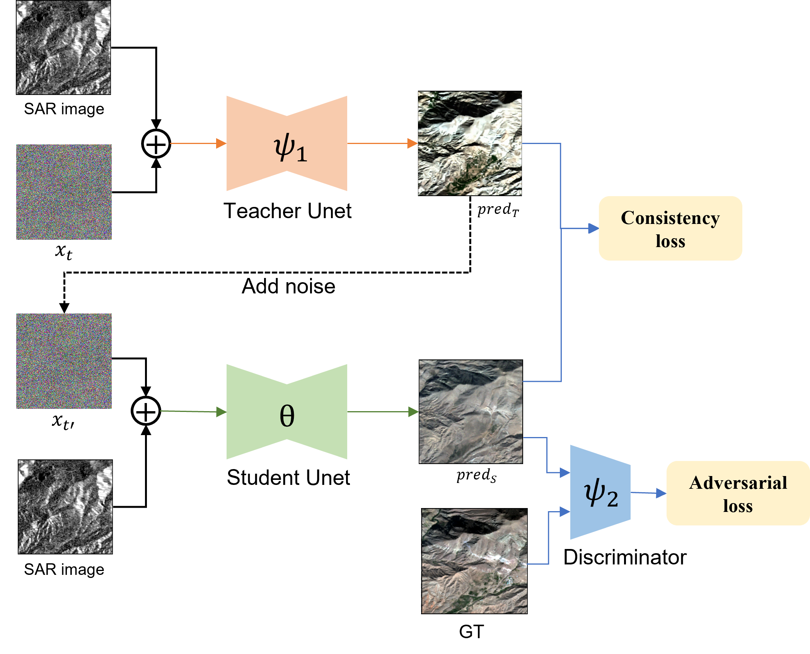

# Accelerating Diffusion for SAR-to-Optical Image Translation via Adversarial Consistency Distillation

This is the official implementation of [Accelerating Diffusion for SAR-to-Optical Image Translation via Adversarial Consistency Distillation](https://arxiv.org/abs/2407.06095). And the training code from the [previous work](https://github.com/Coordi777/Conditional-Diffusion-for-SAR-to-Optical-Image-Translation) has been optimized using the [diffusers🤗](https://github.com/huggingface/diffusers).

This repository is based on [diffusers🤗](https://github.com/huggingface/diffusers).

## Updates
📣[2025.3.7] Pre-trained model weights are now publicly available.

📣[2025.3.5] Make the inference script more readable.

## Overview

### Abstract

Translating SAR images into more easily recognizable optical images using diffusion models helps address this challenge. However, diffusion models suffer from high latency due to numerous iterative inferences, while Generative Adversarial Networks (GANs) can achieve image translation with just a single iteration but often at the cost of image quality. To overcome these issues, we propose a new training framework for SAR-to-optical image translation that combines the strengths of both approaches. Our method employs consistency distillation to reduce iterative inference steps and integrates adversarial learning to ensure image clarity and minimize color shifts. Additionally, our approach allows for a trade-off between quality and speed, providing flexibility based on application requirements.

### Training Framework



### Train

- We provide three training strategies: the **first** is the original training (the optimized version of `train.py`). See more in this [Codebase](https://github.com/Coordi777/Conditional-Diffusion-for-SAR-to-Optical-Image-Translation).
- The **second** is distillation without adversarial training (`lcm_train.py`).
- The **third** is the newly proposed continuous distillation with adversarial learning (`lcm_adv_train.py`).
- The training parameters are detailed in the code and are mainly passed through a YAML file. We provide an example YAML file (`configs_example.yaml`).
- Training can be started directly by running the training script, but make sure to update the parameters to your own.

```bash
bash train.sh
```

### Requirement

Make sure your environment is set up with PyTorch, Diffusers, and Accelerate according to the official requirements.

### Checkponits

We provide pre-trained weights (including both the ​model and ​discriminator) trained on the `SEN-12` dataset using the ​LCM_ADV:
- [​Baidu Netdisk](https://pan.baidu.com/s/18uKtx53davt9RMReXm02Hw?pwd=bzjz)
- [Google Drive](https://drive.google.com/file/d/1JiE00Bb_Jvww56TjaXMEoCeuOa223gJO/view?usp=drive_link)

**Note:** Due to limitations in the training process, the model may not always generate high-quality optical images in all scenarios.

### Cite

```
@misc{bai2024acceleratingdiffusionsartoopticalimage,
      title={Accelerating Diffusion for SAR-to-Optical Image Translation via Adversarial Consistency Distillation}, 
      author={Xinyu Bai and Feng Xu},
      year={2024},
      eprint={2407.06095},
      archivePrefix={arXiv},
      primaryClass={cs.CV},
      url={https://arxiv.org/abs/2407.06095}, 
}
```

